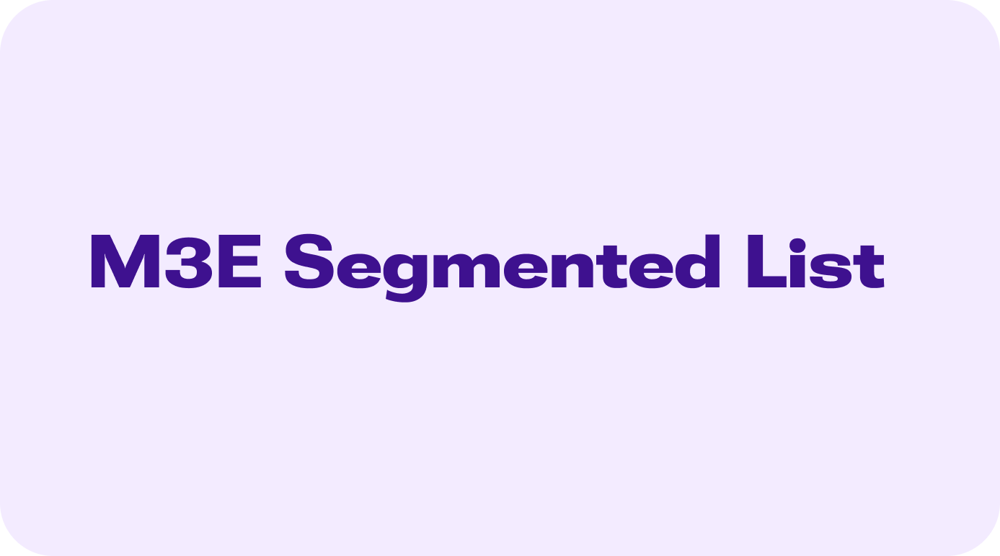

# M3E Segmented List



A Flutter package providing expressive, Material 3 segmented list components with dynamically rounded corners, selection support, and spring-physics motion. Items automatically morph their corner radii (larger outer radii on the first and last items, smaller inner radii between adjoining items) to adhere to Material 3's expressive list design.

It provides multiple list variants — an interactive list (`M3ESegmentedList`), a static column (`M3ESegmentedColumn`), a sliver variant (`SliverM3ESegmentedList`), and a spring-physics reorderable list (`M3EReorderableSegmentedList`) — plus expandable folder-like items (`M3EExpandableSegmentedItem`), single/multi selection modes with animated checkmark badges, and rich customization via `M3ESegmentedListDecoration`.

---

## 🎮 Interactive Demo

You can try out the package demo here: [m3e_core demo](https://mudit200408.github.io/m3e_core/)

---

## 🚀 Features

- **Dynamic Corner Morphing** — outer/inner radii automatically assigned per item position, spring-animated on every state change
- **Selection Modes** — single (radio behavior) or multiple selection with tap/long-press triggers and an animated checkmark badge
- **Spring-Physics Reordering** — `M3EReorderableSegmentedList` with a dynamic destination placeholder slot, bouncy neighbor displacement, and smooth snap settling
- **Expandable Items** — `M3EExpandableSegmentedItem` folder-like parent-child containers with staggered cascade motion
- **Multiple Variants** — Column-based, `ListView.builder`-based, static, and sliver list layouts
- **Haptic Feedback** — light, medium, or heavy impact on interaction via `M3EHapticFeedback`
- **Expressive Motion** — spring motion presets via `M3EMotion` for radius morphing and selection transitions
- **State Styling** — dedicated color, border, radius, and elevation tokens for disabled, focused, hovered, pressed, and selected states
- **Accessibility** — semantic label builder, keyboard focus with visual highlight, and mouse cursor support
- **Custom Decoration** — geometry, colors, borders, elevation, motion, and drag styling via `M3ESegmentedListDecoration`

---

## 📦 Installation

> [!IMPORTANT]
> **Flutter 3.47+ & `material_ui` Requirement**:
> `m3e_segmented_list` is built on the standalone `material_ui` package decoupled in **Flutter 3.47.0**.
> - Requires Flutter SDK **`>=3.47.0`**.
> - Ensure your app imports `package:material_ui/material_ui.dart` (or run `dart fix --apply --code=migrate_design_widgets`).

Add `m3e_segmented_list` and `material_ui` to your `pubspec.yaml`:

```yaml
dependencies:
  material_ui: ^1.0.0
  m3e_segmented_list: ^0.0.1
```

```dart
import 'package:material_ui/material_ui.dart';
import 'package:m3e_segmented_list/m3e_segmented_list.dart';
```

---

## 🧩 Quick Start

### Basic Segmented List

```dart
M3ESegmentedList(
  itemCount: 4,
  itemBuilder: (context, index) => M3EListItem(
    leading: const Icon(Icons.person_outline),
    headline: Text('Person $index'),
    supportingText: const Text('Tap to interact'),
  ),
)
```

### Selection with Checkmark

```dart
Set<int> _selected = {};

M3ESegmentedList(
  itemCount: 4,
  selectionMode: M3ESelectionMode.multiple,
  selectionTrigger: M3ESelectionTrigger.tap,
  selectedIndices: _selected,
  showSelectionCheckmark: true,
  onSelectionChanged: (selection) => setState(() => _selected = selection),
  itemBuilder: (context, index) => M3EListItem(
    headline: Text('Item $index'),
  ),
)
```

### Lazy Builder List

```dart
M3ESegmentedList.builder(
  itemCount: 100,
  itemBuilder: (context, index) => M3EListItem(
    headline: Text('Item $index'),
  ),
)
```

### Reorderable List

```dart
List<String> _items = ['Design', 'Develop', 'Test', 'Ship'];

M3EReorderableSegmentedList(
  onReorder: (oldIndex, newIndex) {
    setState(() {
      if (newIndex > oldIndex) newIndex -= 1;
      final item = _items.removeAt(oldIndex);
      _items.insert(newIndex, item);
    });
  },
  children: [
    for (final item in _items)
      M3EListItem(
        headline: Text(item),
        trailing: const Icon(Icons.drag_handle_rounded),
      ),
  ],
)
```

### Expandable Folder Item

```dart
bool _expanded = false;

M3ESegmentedColumn(
  children: [
    M3EExpandableSegmentedItem(
      index: 0,
      totalCount: 1,
      isExpanded: _expanded,
      onToggle: () => setState(() => _expanded = !_expanded),
      header: const M3EListItem(
        leading: Icon(Icons.folder_outlined),
        headline: Text('Projects'),
      ),
      children: const [
        M3EListItem(headline: Text('Design tokens')),
        M3EListItem(headline: Text('Component kit')),
      ],
    ),
  ],
)
```

### Sliver Variant

```dart
CustomScrollView(
  slivers: [
    const SliverAppBar(title: Text('Inbox')),
    SliverM3ESegmentedList(
      itemCount: 20,
      itemBuilder: (context, index) => M3EListItem(
        leading: const Icon(Icons.mail_outline),
        headline: Text('Mail $index'),
      ),
    ),
  ],
)
```

---

## 📖 Detailed API Guide

### 1. `M3EMotion`

Spring physics configuration with 14 built-in presets and custom spring support.

#### 🏗️ Spatial Presets (Shape Morphing)
Used for animating corner radii and layout transitions.

| Preset | Stiffness | Damping | Description |
|--------|-----------|---------|-------------|
| `standardSpatialFast` | `1400` | `0.9` | Snappy spring for responsive feel |
| `standardSpatialDefault` | `700` | `0.9` | Balanced spring for general use |
| `standardSpatialSlow` | `300` | `0.9` | Relaxed spring for dramatic feel |
| `expressiveSpatialFast` | `800` | `0.6` | Bouncier spring for expressive feel |
| `expressiveSpatialDefault` | `380` | `0.8` | Bouncy, balanced spring |
| `expressiveSpatialSlow` | `200` | `0.8` | Very bouncy for dramatic feel |

#### ✨ Effects Presets (Opacity/Scale)
Used for content animations like cross-fades.

| Preset | Stiffness | Damping | Description |
|--------|-----------|---------|-------------|
| `standardEffectsFast` | `3800` | `1.0` | Snappy effect animation |
| `standardEffectsDefault` | `1600` | `1.0` | Balanced effect animation |
| `standardEffectsSlow` | `800` | `1.0` | Relaxed effect animation |
| `expressiveEffectsFast` | `3800` | `1.0` | Snappy expressive effect |
| `expressiveEffectsDefault` | `1600` | `1.0` | Balanced expressive effect |
| `expressiveEffectsSlow` | `800` | `1.0` | Relaxed expressive effect |

#### 📦 Overflow & Popup Presets
Used for overflow menus and popup animations.

| Preset | Stiffness | Damping | Description |
|--------|-----------|---------|-------------|
| `standardOverflow` | `1600` | `0.85` | Spring for overflow menus and popups |
| `standardPopup` | `1000` | `0.6` | Bouncy spring for popup menus |

#### 🛠️ Custom Motion

```dart
M3EMotion.custom(stiffness: 1200, damping: 0.75)
```

---

### 2. `M3EHapticFeedback`

Haptic feedback intensity levels for list interactions.

| Level | Value | Description |
|-------|-------|-------------|
| `none` | `0` | No haptic feedback (default) |
| `light` | `1` | Light tap feedback |
| `medium` | `2` | Medium impact feedback |
| `heavy` | `3` | Heavy impact feedback |

```dart
M3ESegmentedListDecoration(haptic: M3EHapticFeedback.light)
```

---

### 3. Selection & Position Enums

#### `M3ESelectionMode`

| Value | Description |
|-------|-------------|
| `multiple` | Multiple items can be selected simultaneously |
| `single` | Only a single item can be selected at a time (radio behavior) |
| `none` | Selection is disabled (default) |

#### `M3ESelectionTrigger`

| Value | Description |
|-------|-------------|
| `tap` | Tapping directly selects or deselects the item (default) |
| `longPress` | Long-pressing toggles selection on the item |
| `both` | Both tapping and long-pressing toggle selection |
| `none` | Selection is not toggled by gestures (controlled strictly programmatically) |

#### `M3ESegmentedItemPosition`

| Value | Description |
|-------|-------------|
| `first` | The first item in a list with more than one item |
| `middle` | An item between the first and last items |
| `last` | The last item in a list with more than one item |
| `single` | The only item in a list |

---

### 4. `M3ESegmentedListDecoration`

Styling, geometry, motion, and interaction overrides for all segmented list variants. If provided via a widget's `decoration` parameter, its values take precedence over the widget's individual parameters.

| Parameter | Type | Default | Description |
|-----------|------|---------|-------------|
| `outerRadius` | `double` | `24.0` | Corner radius for the first and last items |
| `innerRadius` | `double` | `4.0` | Corner radius between adjoining items |
| `gap` | `double` | `2.0` | Gap spacing between items |
| `color` | `Color?` | `surfaceContainer` | Default background color of segmented items |
| `padding` | `EdgeInsetsGeometry?` | — | Inner padding inside each item |
| `margin` | `EdgeInsetsGeometry?` | — | Outer margin surrounding the container |
| `border` | `BorderSide?` | `BorderSide.none` | Border outline for resting items |
| `elevation` | `double` | `0.0` | Elevation shadow for resting items |
| `splashColor` | `Color?` | — | Splash color for touch ripples |
| `highlightColor` | `Color?` | — | Highlight color for presses |
| `hoverColor` | `Color?` | — | Hover color for mouse hover |
| `focusColor` | `Color?` | — | Focus color for keyboard focus highlight |
| `splashFactory` | `InteractiveInkFeatureFactory?` | — | Custom splash factory for ink ripples |
| `enableFeedback` | `bool` | `true` | Whether acoustic/haptic feedback is enabled |
| `haptic` | `M3EHapticFeedback` | `none` | Haptic feedback level on interaction |
| `disabledColor` | `Color?` | — | Background color for disabled items |
| `disabledBorder` | `BorderSide?` | — | Border for disabled items |
| `focusedColor` | `Color?` | — | Background color when focused |
| `focusedBorder` | `BorderSide?` | — | Border outline when focused |
| `focusedRadius` | `double?` | — | Corner radius applied to all corners when focused |
| `focusedBorderRadius` | `BorderRadius?` | — | Custom border radius when focused |
| `focusedElevation` | `double?` | — | Elevation when focused |
| `selectedColor` | `Color?` | — | Background color for selected items |
| `selectedBorder` | `BorderSide?` | — | Border for selected items |
| `selectedRadius` | `double?` | — | Corner radius applied to all corners when selected |
| `selectedBorderRadius` | `BorderRadius?` | — | Custom border radius when selected |
| `selectedElevation` | `double?` | — | Elevation for selected items |
| `showSelectionCheckmark` | `bool` | `false` | Whether to render an animated checkmark badge on selected items |
| `selectionCheckmarkAlignment` | `Alignment` | `centerRight` | Alignment of the checkmark badge |
| `pressedRadius` | `double?` | — | Corner radius applied to all corners when pressed |
| `pressedBorderRadius` | `BorderRadius?` | — | Custom border radius when pressed |
| `hoveredRadius` | `double?` | — | Corner radius applied to all corners when hovered |
| `hoveredBorderRadius` | `BorderRadius?` | — | Custom border radius when hovered |
| `motion` | `M3EMotion` | `expressiveSpatialFast` | Spring motion for normal and selection transitions |
| `pressedMotion` | `M3EMotion` | `expressiveSpatialFast` | Spring motion for pressed state transitions |
| `dragRadius` | `double?` | — | Corner radius applied to all corners while dragging |
| `dragBorderRadius` | `BorderRadius?` | `circular(24.0)` | Border radius of the dragged item |
| `dragElevation` | `double` | `8.0` | Elevation of the dragged item proxy |
| `dragScale` | `double` | `1.0` | Scale multiplier of the dragged item proxy |
| `dragColor` | `Color?` | `surfaceContainerHigh` | Background color of the dragged item |
| `dragPlaceholderColor` | `Color?` | `surfaceContainerLow` | Background color of the drop target placeholder slot |
| `dragPlaceholderBorder` | `BorderSide?` | — | Border outline of the placeholder slot |
| `dragPlaceholderRadius` | `double?` | — | Corner radius of the placeholder slot |
| `dragPlaceholderBuilder` | `Widget Function(BuildContext, int, Size)?` | — | Custom builder for the placeholder slot |

```dart
M3ESegmentedList(
  itemCount: 3,
  decoration: M3ESegmentedListDecoration(
    outerRadius: 28.0,
    innerRadius: 8.0,
    gap: 4.0,
    selectedColor: cs.secondaryContainer,
    selectedRadius: 28.0,
    showSelectionCheckmark: true,
    haptic: M3EHapticFeedback.light,
    motion: M3EMotion.expressiveSpatialSlow,
  ),
  itemBuilder: (context, index) => M3EListItem(
    headline: Text('Item $index'),
  ),
)
```

---

### 5. List Widgets

#### `M3ESegmentedList`

Interactive segmented list rendered via a [Column] (default constructor) for small lists.

| Parameter | Type | Default | Description |
|-----------|------|---------|-------------|
| `itemCount` | `int` | — | Number of items in the list |
| `itemBuilder` | `IndexedWidgetBuilder` | — | Creates a widget for a given index |
| `decoration` | `M3ESegmentedListDecoration?` | — | Styling, motion, and interaction overrides |
| `outerRadius` | `double` | `24.0` | Corner radius for first/last items |
| `innerRadius` | `double` | `4.0` | Corner radius between adjoining items |
| `gap` | `double` | `2.0` | Gap space between adjacent items |
| `color` | `Color?` | `surfaceContainer` | Item background color when unselected |
| `padding` | `EdgeInsetsGeometry?` | `all(12.0)` | Inner padding of each item |
| `margin` | `EdgeInsetsGeometry?` | `EdgeInsets.zero` | Outer margin around the entire list |
| `onTap` | `void Function(int index)?` | — | Called when an item is tapped |
| `onLongPress` | `void Function(int index)?` | — | Called when an item is long-pressed |
| `semanticLabelBuilder` | `String Function(int index)?` | — | Semantic label builder for accessibility |
| `mouseCursor` | `MouseCursor?` | — | Mouse cursor when hovering an item |
| `focusColor` | `Color?` | — | Color when an item is keyboard-focused |
| `hoverColor` | `Color?` | — | Color when an item is hovered |
| `onFocusChange` | `void Function(int index, bool)?` | — | Called when an item's focus state changes |
| `border` | `BorderSide?` | `BorderSide.none` | Border around each item when unselected |
| `elevation` | `double` | `0` | Elevation of each item when unselected |
| `splashColor` | `Color?` | — | Splash color of the ink response |
| `highlightColor` | `Color?` | — | Highlight color of the ink response |
| `splashFactory` | `InteractiveInkFeatureFactory?` | — | Appearance of the splash |
| `enableFeedback` | `bool` | `true` | Whether gestures provide acoustic/haptic feedback |
| `haptic` | `M3EHapticFeedback` | `none` | Haptic feedback on interaction |
| `isEnabled` | `bool Function(int index)?` | — | Predicate determining if an item is enabled |
| `emptyBuilder` | `Widget?` | — | Widget displayed when the list is empty |
| `selectedIndices` | `Set<int>?` | — | Currently selected item indices |
| `onSelectionChanged` | `ValueChanged<Set<int>>?` | — | Called whenever the selection set changes |
| `selectionMode` | `M3ESelectionMode` | `none` | Selection mode (none, single, multiple) |
| `selectionTrigger` | `M3ESelectionTrigger` | `tap` | Gesture that triggers selection |
| `isSelected` | `bool Function(int index)?` | — | Custom predicate for item selection |
| `selectedColor` | `Color?` | — | Background color for selected items |
| `selectedBorder` | `BorderSide?` | — | Border for selected items |
| `selectedRadius` | `double?` | — | Corner radius when selected |
| `selectedBorderRadius` | `BorderRadius?` | — | Custom border radius when selected |
| `selectedElevation` | `double?` | — | Elevation for selected items |
| `pressedRadius` | `double?` | — | Corner radius when pressed |
| `pressedBorderRadius` | `BorderRadius?` | — | Custom border radius when pressed |
| `hoveredRadius` | `double?` | — | Corner radius when hovered |
| `hoveredBorderRadius` | `BorderRadius?` | — | Custom border radius when hovered |
| `showSelectionCheckmark` | `bool` | `false` | Whether to render the animated checkmark badge |
| `selectionCheckmarkAlignment` | `Alignment` | `centerRight` | Alignment of the checkmark badge |
| `selectionCheckmarkBuilder` | `Widget Function(BuildContext, int, bool)?` | — | Custom builder for the checkmark badge |
| `motion` | `M3EMotion` | `expressiveSpatialFast` | Spring motion for selection transitions |
| `pressedMotion` | `M3EMotion` | `expressiveSpatialFast` | Spring motion for pressed transitions |

#### `M3ESegmentedList.builder`

Lazily loaded variant rendered via a `ListView.builder` for large or infinite lists. Supports all `M3ESegmentedList` parameters plus:

| Parameter | Type | Default | Description |
|-----------|------|---------|-------------|
| `controller` | `ScrollController?` | — | Controls the scroll position |
| `physics` | `ScrollPhysics?` | — | How the scroll view responds to input |
| `shrinkWrap` | `bool` | `false` | Whether the scroll view sizes itself to its children |
| `listPadding` | `EdgeInsetsGeometry?` | — | Padding for the scrollable list itself |
| `addAutomaticKeepAlives` | `bool` | `true` | Whether to wrap children in `AutomaticKeepAlive` |
| `addRepaintBoundaries` | `bool` | `true` | Whether to wrap children in `RepaintBoundary` |
| `addSemanticIndexes` | `bool` | `true` | Whether to wrap children in `IndexedSemantics` |
| `cacheExtent` | `double?` | — | Cache extent of the scroll view |
| `dragStartBehavior` | `DragStartBehavior` | `start` | Drag start behavior |
| `keyboardDismissBehavior` | `ScrollViewKeyboardDismissBehavior` | `manual` | How the scroll view dismisses the keyboard |
| `restorationId` | `String?` | — | Restoration ID to save/restore the scroll offset |
| `clipBehavior` | `Clip` | `hardEdge` | Clip behavior of the scroll view |

> Note: `.builder` uses `motion: M3EMotion.standardSpatialDefault` and `pressedMotion: M3EMotion.expressiveEffectsFast` defaults, tuned for scroll performance.

#### `M3ESegmentedColumn`

Static segmented column built from an explicit list of `children` — ideal for small, fully-built lists. Shares the same styling, interaction, selection, and `decoration` API as `M3ESegmentedList`.

| Parameter | Type | Default | Description |
|-----------|------|---------|-------------|
| `children` | `List<Widget>` | — | The static list of children to display |
| `decoration` | `M3ESegmentedListDecoration?` | — | Styling, motion, and interaction overrides |
| `outerRadius` | `double` | `24.0` | Corner radius for first/last items |
| `innerRadius` | `double` | `4.0` | Corner radius between adjoining items |
| `gap` | `double` | `2.0` | Gap space between adjacent items |
| `color` | `Color?` | `surfaceContainer` | Item background color when unselected |
| `padding` | `EdgeInsetsGeometry?` | — | Inner padding of each child |
| `margin` | `EdgeInsetsGeometry?` | — | Outer margin around the group |
| `onTap` / `onLongPress` | `void Function(int index)?` | — | Item interaction callbacks |
| `semanticLabelBuilder` | `String Function(int index)?` | — | Semantic label builder for accessibility |
| `mouseCursor` / `focusColor` / `hoverColor` / `onFocusChange` | — | — | Mouse & focus interaction overrides |
| `border` / `elevation` / `splashColor` / `highlightColor` / `splashFactory` / `enableFeedback` / `haptic` | — | — | Ink & feedback styling |
| `isEnabled` | `bool Function(int index)?` | — | Predicate determining if a child is enabled |
| `emptyBuilder` | `Widget?` | — | Widget displayed when children is empty |
| `selectedIndices` / `onSelectionChanged` / `selectionMode` / `selectionTrigger` / `isSelected` | — | — | Selection API (see `M3ESegmentedList`) |
| `selectedColor` / `selectedBorder` / `selectedRadius` / `selectedBorderRadius` / `selectedElevation` | — | — | Selected state styling |
| `pressedRadius` / `pressedBorderRadius` / `hoveredRadius` / `hoveredBorderRadius` | — | — | Interactive morphing radii |
| `showSelectionCheckmark` / `selectionCheckmarkAlignment` / `selectionCheckmarkBuilder` | — | — | Checkmark badge customization |
| `motion` / `pressedMotion` | `M3EMotion` | `expressiveSpatialFast` | Spring motion presets |

#### `SliverM3ESegmentedList`

Sliver variant for use inside a `CustomScrollView`. Takes `itemCount` + `itemBuilder` and the same styling/selection API as `M3ESegmentedList` (margin is applied via `SliverPadding`).

```dart
SliverM3ESegmentedList(
  itemCount: 10,
  itemBuilder: (context, index) => M3EListItem(
    headline: Text('Row $index'),
  ),
)
```

#### `M3EReorderableSegmentedList`

Spring-physics reorderable segmented list with a dynamic destination placeholder slot, bouncy spring neighbor displacement, and smooth snap settling. Dragging is initiated via a **long-press** on an item. Use the default constructor with `children`, or `.builder` with `itemCount`/`itemBuilder` for lazy lists.

| Parameter | Type | Default | Description |
|-----------|------|---------|-------------|
| `children` / `itemCount` + `itemBuilder` | — | — | List content (default vs `.builder` constructor) |
| `onReorder` | `ReorderCallback` | — | Called when a list child has moved to a new position |
| `decoration` | `M3ESegmentedListDecoration?` | — | Styling, motion, interaction, and drag overrides |
| `keyBuilder` | `Key Function(int index)?` | — | Unique, stable keys for each item |
| `header` | `Widget?` | — | Non-reorderable widget displayed before the list items |
| `footer` | `Widget?` | — | Non-reorderable widget displayed after the list items |
| `outerRadius` | `double` | `24.0` | Corner radius for first/last items |
| `innerRadius` | `double` | `4.0` | Corner radius between adjoining items |
| `gap` | `double` | `2.0` | Gap space between adjacent items |
| `buildDefaultDragHandles` | `bool` | `false` | Whether to append a trailing `drag_handle_rounded` icon as a visual drag cue |
| `dragElevation` | `double` | `8.0` | Elevation applied to the dragged item |
| `dragScale` | `double` | `1.0` | Scale multiplier applied to the dragged item |
| `dragRadius` | `double?` | — | Corner radius applied to all corners while dragging |
| `dragBorderRadius` | `BorderRadius?` | `circular(24.0)` | Detached floating appearance radius of the dragged item |
| `dragColor` | `Color?` | `surfaceContainerHigh` | Background color of the dragged item |
| `dragPlaceholderColor` | `Color?` | `surfaceContainerLow` | Background color of the drop target placeholder slot |
| `dragPlaceholderBorder` | `BorderSide?` | — | Border outline of the placeholder slot |
| `dragPlaceholderRadius` | `double?` | — | Corner radius of the placeholder slot |
| `dragPlaceholderBuilder` | `Widget Function(BuildContext, int, Size)?` | — | Custom builder for the placeholder slot |
| `controller` / `physics` / `shrinkWrap` / `listPadding` / `dragStartBehavior` / `keyboardDismissBehavior` | — | — | Scroll view configuration |
| `haptic` | `M3EHapticFeedback` | `none` | Haptic feedback on interaction |
| `isEnabled` / `emptyBuilder` / selection API / state styling / `motion` / `pressedMotion` | — | — | Same as `M3ESegmentedList` |

#### `M3EExpandableSegmentedItem`

Expandable folder-like item with parent-child containers. When collapsed, the parent's shape corresponds to its list position; when expanded, its bottom corners morph to `innerRadius`, children cascade into view with staggered spring slide & scale motion, and the terminal child inherits the parent's bottom radius.

| Parameter | Type | Default | Description |
|-----------|------|---------|-------------|
| `index` | `int` | — | Index of this item in the outer list |
| `totalCount` | `int` | — | Total count of items in the outer list |
| `isExpanded` | `bool` | — | Whether this item is currently expanded |
| `onToggle` | `VoidCallback` | — | Called when the expansion toggle is triggered |
| `header` | `Widget?` | — | Primary header widget (e.g. `M3EListItem`) |
| `headerBuilder` | `Widget Function(BuildContext, double progress)?` | — | Dynamic header content receiving expansion progress (`0.0`–`1.0`) |
| `children` | `List<Widget>?` | — | Child widgets to display when expanded |
| `childCount` + `childBuilder` | `int?` + builder | — | Lazy child widgets alternative to `children` |
| `outerRadius` | `double` | `24.0` | Outer corner radius for top/bottom extremities |
| `innerRadius` | `double` | `4.0` | Inner corner radius for adjoining segments |
| `gap` | `double` | `2.0` | Vertical gap between parent and child items |
| `color` / `childColor` | `Color?` | — | Background of parent / child containers |
| `padding` / `childPadding` | `EdgeInsetsGeometry?` | — | Padding around header / child contents |
| `border` / `elevation` | — | — | Item container border & elevation |
| `enabled` | `bool` | `true` | Whether expansion toggling is enabled |
| `expandMotion` / `collapseMotion` | `M3EMotion` | `expressiveSpatialFast` | Spring motion for expanding / collapsing |
| `pressedMotion` | `M3EMotion` | `expressiveSpatialFast` | Motion physics for pressed animations |
| `tapHeaderToToggle` | `bool` | `true` | Whether tapping the header toggles expansion |
| `trailingIcon` | `Widget?` | — | Custom expand/collapse indicator (default rotating chevron) |
| `showTrailingIcon` | `bool` | `true` | Whether to show the trailing expand icon |
| `haptic` | `M3EHapticFeedback` | `light` | Haptic feedback on expand/collapse |
| `selectedChildIndices` | `Set<int>?` | — | Set of child indices that are currently selected |
| `onChildTap` / `onChildLongPress` | `void Function(int childIndex)?` | — | Child interaction callbacks |
| `selectedRadius` | `double?` | `outerRadius` | Corner radius when a child is selected |
| `selectedBorderRadius` | `BorderRadius?` | — | Custom border radius when a child is selected |
| `selectedColor` | `Color?` | `secondaryContainer` | Background color for selected child items |
| `selectedBorder` / `selectedElevation` | — | — | Selected child border & elevation |
| `childSplashColor` / `childHighlightColor` / `childHoverColor` / `childFocusColor` | `Color?` | — | Child item ink colors |
| `showSelectionCheckmark` | `bool` | `false` | Whether to show a checkmark badge on selected children |
| `selectionCheckmarkAlignment` | `Alignment` | `centerRight` | Alignment of the checkmark badge |
| `selectionCheckmarkBuilder` | `Widget Function(BuildContext, bool)?` | — | Custom builder for the checkmark badge |
| `showTrailingPill` | `bool` | `true` | Whether to show a trailing pill/oval container behind the icon |
| `showTrailingPillOnlyWhenExpanded` | `bool` | `true` | Whether the pill fades/scales in only while expanded |
| `trailingPillColor` | `Color?` | `surfaceContainerHighest` | Background color of the trailing pill |
| `trailingPillBorderRadius` | `BorderRadius?` | stadium | Border radius of the trailing pill |
| `trailingPillSize` | `Size` | `Size(32.0, 48.0)` | Dimensions of the trailing pill |
| `trailingIconColor` | `Color?` | — | Custom color for the trailing toggle icon |

#### `M3EListItem`

Material 3 standardized list item slot widget used as item content. Automatic layout rules: one-line items are `56dp` tall, two-line `72dp`, and three-line `88dp` and top-aligned.

| Parameter | Type | Default | Description |
|-----------|------|---------|-------------|
| `leading` | `Widget?` | — | Leading visual (icon, avatar, checkbox, or thumbnail) |
| `headline` | `Widget` | — | Primary headline text or widget |
| `supportingText` | `Widget?` | — | Secondary supporting text |
| `overline` | `Widget?` | — | Tertiary label positioned above the headline |
| `trailing` | `Widget?` | — | Trailing metadata, icon, control, or drag handle |
| `isThreeLine` | `bool?` | auto-inferred | Force three-line layout (top-aligned leading/trailing) |
| `contentPadding` | `EdgeInsetsGeometry?` | `h16/v10` (`h16/v12` for 3-line) | Padding around the content |
| `minHeight` | `double?` | `56/72/88` | Minimum height of the item container |
| `leadingSpacing` | `double` | `12.0` | Space between leading and the text column |
| `trailingSpacing` | `double` | `12.0` | Space between the text column and trailing |
| `headlineStyle` | `TextStyle?` | — | Custom text style for the headline |
| `supportingTextStyle` | `TextStyle?` | — | Custom text style for supporting text |
| `overlineStyle` | `TextStyle?` | — | Custom text style for the overline |
| `enabled` | `bool` | `true` | Whether the item is interactive; false renders M3 disabled colors/opacity |

#### `M3ESegmentedItem`

The individual segmented item building block with spring-driven morphing corner radii. Exposes `index`, `position` (`M3ESegmentedItemPosition`), `child`, geometry (`outerRadius`/`innerRadius`/`gap`), full state styling, `focusNode`/`autofocus`, selection, checkmark, and motion parameters — all of which are managed automatically when using the list widgets above.

---

### 6. Selection Checkmark Customization

Selected items can display an animated checkmark badge (`M3EDefaultSelectionBadge`) that scales and fades in. Customize its position and appearance:

```dart
M3ESegmentedList(
  itemCount: 4,
  selectionMode: M3ESelectionMode.multiple,
  selectedIndices: _selected,
  onSelectionChanged: (s) => setState(() => _selected = s),
  showSelectionCheckmark: true,
  selectionCheckmarkAlignment: Alignment.centerLeft,
  selectionCheckmarkBuilder: (context, index, isSelected) => Icon(
    isSelected ? Icons.check_circle : Icons.radio_button_unchecked,
    color: isSelected ? cs.primary : cs.outline,
  ),
  itemBuilder: (context, index) => M3EListItem(
    headline: Text('Item $index'),
  ),
)
```

---

### 7. Accessibility

- **Semantic labels** — provide `semanticLabelBuilder` so screen readers announce meaningful item descriptions.
- **Keyboard focus** — items are focusable with a visible focus highlight (`focusColor`, `focusedRadius`, `focusedElevation`); observe focus via `onFocusChange`.
- **Disabled states** — the `isEnabled` per-item predicate renders full M3 disabled styling (colors, borders, no interaction).
- **Mouse support** — `mouseCursor`, `hoverColor`, and hovered radius morphing for desktop/web.

---

## 🐞 Found a bug? or ✨ You have a Feature Request?

Feel free to open an [Issue](https://github.com/Mudit200408/m3e_core/issues) or [Contribute](https://github.com/Mudit200408/m3e_core/pulls) to the project.

Hope You Love It!

---

## Credits

- [Motor](https://pub.dev/packages/motor) Pub Package for Expressive Animations
- Claude and Gemini for helping me with the code and documentation.

### Radhe Radhe 🙏
